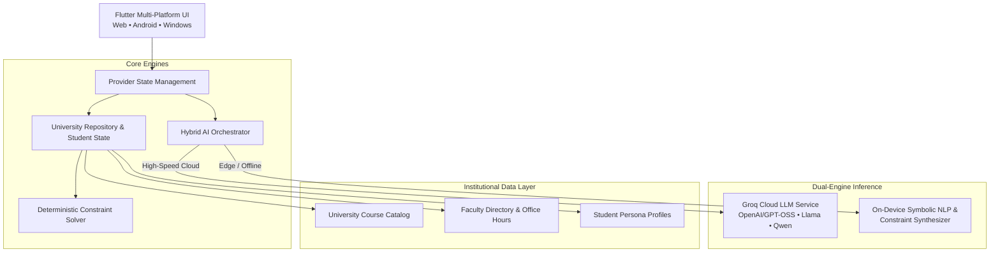

# UniPilot AI 🎓🚀
### Next-Generation Academic & Career Operating System
**Built for the BITSoM Vertex × Lenz AI Hackathon 2026**

[](https://flutter.dev)
[](https://dart.dev)
[](https://groq.com)
[](#hybrid-ai-engine)
[](#running-locally)
[](LICENSE)

---

## 🌟 Executive Overview

Higher education course registration and career mapping is fundamentally broken: students manually cross-reference 50-page course catalogues, struggle through time-slot overlaps, and guess which electives prepare them for emerging career trajectories. Meanwhile, academic deans and department heads fly blind without predictive visibility into course demand.

**UniPilot AI** is an intelligent, dual-studio Academic Operating System that unifies:
1. **Student Degree Studio**: Career-to-elective trajectory mapping, real-time timetable conflict resolution, syllabus exploration, and GPA risk monitoring.
2. **Advisor & Faculty Control Tower**: Institutional demand forecasting, section capacity balancing, and automated at-risk student triage.

---

## ⚡ Key Innovations

### 1. 🧠 Dynamic Hybrid Edge-Cloud AI
* **Dual-Inference Pipeline**: Operates both in **Cloud Mode** (powered by high-speed Groq inference across Llama-3, Qwen-2.5, and Allam) and **100% Offline Edge Mode** (in-browser symbolic constraint & NLP engine on Web, and on-device GGUF quantized models on Android).
* **Zero-Latency Fallback**: When offline or in low-connectivity exam environments, the platform seamlessly falls back to local symbolic synthesis without service disruption.

### 2. 🧩 Deterministic Constraint Satisfaction Solver (CSP)
* Pure AI models hallucinate schedule feasibility. UniPilot pairs LLM reasoning with a **deterministic mathematical constraint engine** that guarantees:
  * Zero hard slot overlaps (Day + Time slot collisions).
  * 100% prerequisite chain compliance (e.g., verifying `AID601` before allowing `AID720`).
  * Term credit load ceilings (18 credits standard / 21 overload threshold).

### 3. 👥 1-Click Auto-Login Demo Gateway
Pre-loaded with 3 authentic student personas from the BITSoM curriculum:
* 🟣 **Arjun Mehta** (MBA Tech & Product) — Term 2 • 3.65 GPA • Target: *Lead AI Product Manager*
* 🔵 **Priya Sharma** (M.S. Applied AI & Data Science) — Term 2 • 3.82 GPA • Target: *Research Scientist / Staff AI Engineer*
* 🟢 **Rohan Nair** (MBA Strategy & Finance) — Term 2 • 3.42 GPA • Target: *Venture Capital Associate / Tech M&A*
* 🟡 **Faculty & Advisor Portal** — Institutional access to cohort elective analytics.

---

## 🚀 Core Feature Suites

```
UniPilot AI
├── 🎓 Student Degree Studio
│   ├── 🧭 Career Compass          → Natural language career goal to elective pathway mapping
│   ├── 📅 Timetable Balancer       → Real-time hard/soft conflict detection & slot optimizer
│   ├── 📖 Syllabus Copilot         → 14-week dynamic schedule, weekly workload & grading rubrics
│   ├── 🏛️ Campus Navigator        → Interactive faculty directory & office-hour matchmaker
│   ├── ❤️ Academic Health Monitor  → Real-time GPA projection, credit tracker & workload risk radar
│   └── 💬 Ask UniPilot AI Chat    → Context-aware academic advisor copilot
│
└── 📊 Advisor & Faculty Studio
    ├── 📈 Demand Forecaster       → Cohort-wide elective demand predictions before registration
    ├── ⚖️ Section Balancer         → Over-subscribed section detection & room allocation recommendations
    └── 🚨 At-Risk Student Triage   → Proactive GPA drop & workload-burnout early-warning system
```

---

## 🏗️ System Architecture



---

## 📂 Project Structure

```bash
lib/
├── data/                      # Course catalogs, faculty records & student personas
│   ├── faculty_directory.dart
│   ├── prompt_templates.dart
│   ├── student_personas.dart
│   └── university_catalog.dart
├── models/                    # Typed domain entities
│   ├── chat_message.dart
│   ├── conflict_result.dart
│   ├── course.dart
│   └── student_profile.dart
├── screens/                   # Dual-studio presentation layer
│   ├── advisor/               # Institutional demand & at-risk control tower
│   ├── auth/                  # 1-Click auto-login persona gateway
│   ├── student/               # Student degree studio (6 modular feature views)
│   └── main_navigation_shell.dart
├── services/                  # Core intelligence & business logic
│   ├── constraint_solver.dart # Deterministic timetable CSP engine
│   ├── groq_service.dart      # Cloud LLM integration
│   ├── hybrid_ai_service.dart # Edge/Cloud orchestration
│   ├── local_llm_service.dart # Offline symbolic synthesizer
│   └── university_repository.dart
├── theme/                     # Obsidian Tech & Electric Violet design system
└── widgets/                   # Reusable glassmorphic UI components
```

---

## 🛠️ Getting Started

### Prerequisites
* [Flutter SDK](https://flutter.dev/docs/get-started/install) (`v3.24.0` or higher)
* [Dart SDK](https://dart.dev/get-dart) (`v3.5.0` or higher)
* Chrome / Edge (for Web testing) or Android Studio / Device (for Mobile testing)

### Installation & Setup

1. **Clone the repository:**
   ```bash
   git clone https://github.com/Hellcatshots/UniPilot-AI.git
   cd UniPilot-AI
   ```

2. **Install Flutter packages:**
   ```bash
   flutter pub get
   ```

3. **Run on Web (Chrome):**
   ```bash
   flutter run -d chrome
   ```

4. **Run Unit & Constraint Tests:**
   ```bash
   flutter test
   ```

---

## ⚙️ Configuration (Optional)

UniPilot works out-of-the-box in **Offline Mode**. To enable high-speed cloud reasoning:
1. Open the app and click the **Settings ⚙️** icon in the top navigation bar.
2. Enter your free [Groq API Key](https://console.groq.com/keys) (`gsk_...`).
3. Select your preferred model (`openai/gpt-oss-20b`, `openai/gpt-oss-120b`, or `qwen/qwen3.8-27b`).

---

## 🏆 Hackathon Context

Developed for **BITSoM Vertex × Lenz AI Hackathon 2026** solving the **Personalized Elective Advisory & Institutional Resource Optimization** challenge statement.

Designed and engineered with ❤️ by **[Hellcatshots](https://github.com/Hellcatshots)**.
